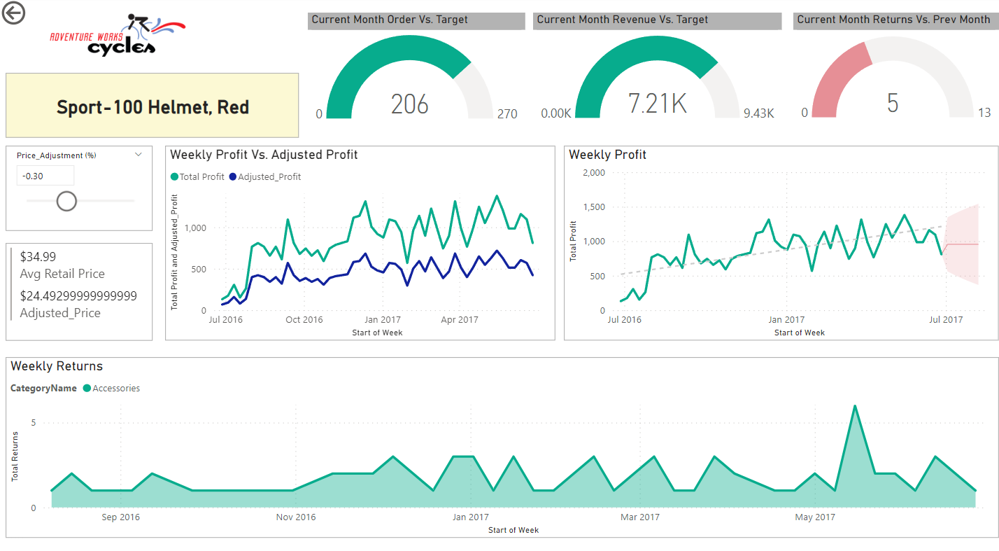

## Purpose 

The purpose of this project is to design and deliver an end-to-end business intelligence solution for Adventure Works Cycles, a global manufacturing company. The following image shows the Executive Summary page of the interactive dashboard. Since the project could not be published on Power BI Service, the repository contains the screenshots of the interactive dashboard.

## Source

- Microsoft Power BI Desktop for Business Intelligence - UDEMY 

## Brief 

The client needs a way to track KPIs(sales, revenue, profit, returns), compare regional performance, analyze product-level trends and forecasts and identify high-value customers.

## Tools Used

- MS Excel
- Microsoft Power BI

## Project Objective 

- Connect and transform the raw data
- Build a relational data model
- Create new calculated columns and DAX measures
- Design an interactive report to analyze and visualize the data

## Data 

The following csv files have been used for the purpose of this project

- AdventureWorks_CalendarLookup
- AdventureWorks_CustomerLookup
- AdventureWorks_ProductCategoryLookup
- AdventureWorks_ProductSubcategoryLookup
- AdventureWorks_ProductLookup
- AdventureWorks_TerritoriesLookup
- AdventureWorks_Sales
-AdventureWorks_Returns

## Table Relationships & Data Model

## Data Visualization

An interactive dashboard has been created that can be used by the end-user to discover the key trends and patterns

### Page 1 : Executive Summary

- The Executive Summary page provides a high level analysis of the Total Orders received by the company by Product Category and Product Sub-category. It also includes the Total Revenue and Total Profit by each category and sub-category.
- The Matrix shows the Total Orders and the Return Rate by Product Name.
- It explores important KPIs such as Current Month Revenue, Current Month Orders and Current Month Returns compared to previous month's figures.
- The page also shows the Top Product in terms of order quantity and Top Product in terms of Profit.
- The page also allows the users to filter the results based on geographic locations relevant to them.
- Finally, by clicking on the product names, users can drill down further to explore more details about individual products in the Product Details Page. For example, the following image shows product level details for the selected product name 'Sport - 100 Helmet, Red'

### Page 2 : Product Details 

- The Product Details page allows the users to drill down to individual product performance.
- The guage charts on top allows users to track **Current Month's Order Volume, Total Revenue and Returns** against the monthly targets for individual products.
- The **Weekly Profit chart** explores the profit trend in general and also includes the weekly profit forecast in the coming weeks.
- The **Weekly Profit Vs.Adjusted Profit** line chart explores the impact that pricing adjustments would have on the company's profits.
- The **Weekly Returns** chart shows the weekly Return trends for individual products.

### Page 3 : Customer Details:

- The Customer Detail page allows the users to gain insights about the company's existing and target customers.
- The Matrix shows the **top 100 customers for the current month** in terms of Total Orders and Total Revenue.
- The donut charts on top breaks down the Total Orders Received by **Customer Gender, Income Level and Occupation**.
- The treemap shows which **customer age group** places the highest number of orders.
- The **Orders & Revenue by Month** chart shows the total orders placed and the revenue earned from individual customers per month.
- The cards below shows the **Top Customer for the current month, the number of orders placed by them and revenue earned from the top customer**.
- The following image shows the changes in the interactive Customer Detail page when the Orders by Gender chart is filtered to select "Female".

 

